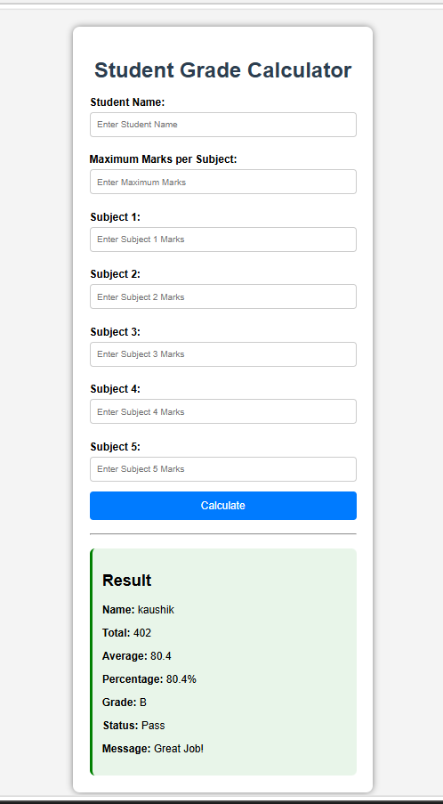

# 🎓 Student Grade Calculator

A simple web application built using **Python (Flask), HTML, and CSS**.
## Screenshot



## Features

- Calculate Total Marks
- Calculate Average
- Calculate Percentage
- Assign Grade (A, B, C, D, F)
- Display Pass/Fail Status
- Show Motivational Message
- User can enter maximum marks dynamically
- Input Validation

## Technologies Used

- Python
- Flask
- HTML
- CSS

## How to Run

1. Clone the repository
2. Install Flask

```bash
pip install -r requirements.txt
```

3. Run the application

```bash
python app.py
```

4. Open your browser and visit:

```
http://127.0.0.1:5000
```

## Author